# WebRtcPerf
[GitHub page](https://github.com/vpalmisano/webrtcperf) | [Documentation](https://vpalmisano.github.io/webrtcperf)

[](https://github.com/vpalmisano/webrtcperf/actions/workflows/build.yaml)

WebRtcPerf is an open-source tool designed for testing WebRTC services with multiple concurrent client connections, measuring the most important RTC statistics and collecting them in an easy way. This documentation will dive into its multiple features and configuration options, showing you how to leverage this tool to gain valuable insights into your real-time communication solutions.

## Prerequisites and installation

The webrtcperf tool is a NodeJS application spawning multiple [Puppeteer](https://pptr.dev/) headless browsers that will actually start the WebRTC connections, so it could ideally run on every platform where NodeJS and Chromium browser could run. Anyway, to gain advantage of some specific features, using a Linux OS is the suggested way to use the tool. If you plan to run multiple concurrent connections to an external host running the WebRTC service, you need to make sure that your machine has enough network bandwidth to send and receive the audio/video streams without affecting the quality and an amount of CPU and memory proportional to the number of clients that you want to start. Anyway, you can also use a limited machine at the purpose, in order to evaluate how the WebRTC server and the client react to the constrained environment. Consider also that the tool uses the [Traffic Controller (TC)](https://tldp.org/HOWTO/Traffic-Control-HOWTO/intro.html) framework on Linux to apply network constraints and change them while running the tests.

The command to install the tool:

```bash
npm install -g @vpalmisano/webrtcperf
webrtcperf --help
```

Make sure to have FFMpeg installed on the same machine.

Alternatively, use the Docker pre-built image:

```bash
docker pull ghcr.io/vpalmisano/webrtcperf:devel
docker run -it ghcr.io/vpalmisano/webrtcperf:devel --help
```

The tool can also be used from the source code:

```bash
git clone https://github.com/vpalmisano/webrtcperf.git
cd webrtcperf
yarn build
yarn start --help
```

## Command line usage

The command line arguments can be explicitly provided using the lower snake case format (e.g. `--run-duration=` or setting the corresponding environment variable in upper snake case format (`RUN_DURATION=`). The command line params have precedence over the corresponding environment variables. Alternatively, it is possible to load the configuration variables saved in lower camel case into a local JSON/JSON5, YAML or TOML file; the file can also be stored remotely and loaded using its public HTTP URL.   
Example running a simple scenario with [Mediasoup demo](https://github.com/vpalmisano/webrtcperf/blob/devel/examples/scenarios/mediasoup.json):

```bash
webrtcperf https://raw.githubusercontent.com/vpalmisano/webrtcperf/refs/heads/devel/examples/scenarios/mediasoup.json
```

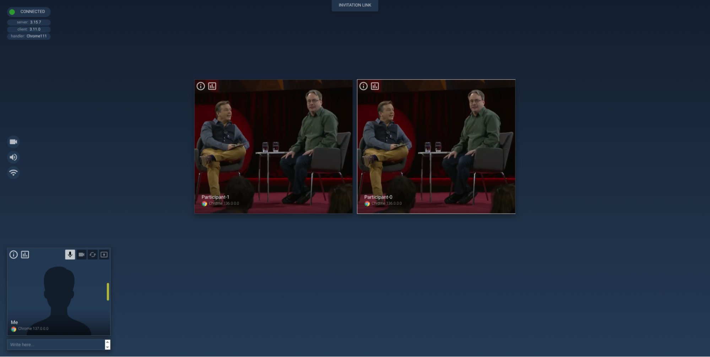

Stop the tool pressing `q` (normal browser close) or `x` (it will close the process immediately).

## Using the tool to run simple tests

Let’s start running some simple test scenarios with only 2 participants. The command line arguments required to join a Google Meet public room are:

```bash
webrtcperf \
  --sessions=1 \
  --run-duration=600 \
  --url=https://meet.google.com/<ID> \
  --debugging-port=9000 \
  --script-path=https://raw.githubusercontent.com/vpalmisano/webrtcperf/refs/heads/devel/examples/google-meet.js
```

In particular, the mandatory arguments are:

- `--sessions`: the total number of chromium browser sessions that we want to start.  
- `--run-duration`: the test run duration in seconds.  
- `--url`: the remote URL that we want to visit.

Other arguments required to join a Google Meet room:

- `--debugging-port`: set to a value different from zero in order to disable the webdriver feature ([https://issues.chromium.org/issues/40746300](https://issues.chromium.org/issues/40746300)).  
- `--script-path`: it injects a javascript code into the running page. It accepts a comma separated list of local file paths or http urls. In this case, the code automatically fills in the user name and it joins the room. 

By default, the tool will periodically output some metrics fetched from the running RTC PeerConnection objects. The metrics are aggregated across all the running sessions, showing the sum (when it makes sense), mean, standard deviation, 5th and 95th percentiles, min and max values. 

```bash
-- Wed, 04 Jun 2025 11:04:30 GMT -------------------------------------------------------------------
                          name    count      sum     mean   stddev       5p      95p      min      max
                    System CPU        1             10.20     0.00    10.20    10.20    10.20    10.20 %
                    System GPU        1             22.00     0.00    22.00    22.00    22.00    22.00 %
                 System Memory        1             33.64     0.00    33.64    33.64    33.64    33.64 %
                      CPU/page        1    92.29    92.29     0.00    92.29    92.29    92.29    92.29 %
                   Memory/page        1  2021.88  2021.88     0.00  2021.88  2021.88  2021.88  2021.88 MB
                         Pages        1        1        1        0        1        1        1        1
                        Errors        1        0        0        0        0        0        0        0
                      Warnings        1        0        0        0        0        0        0        0
              Peer Connections        1        1        1        0        1        1        1        1
-- Inbound audio -----------------------------------------------------------------------------------
-- Inbound video -----------------------------------------------------------------------------------
-- Outbound audio ----------------------------------------------------------------------------------
                          rate        1    73.81    73.81     0.00    73.81    73.81    73.81    73.81 Kbps
                          lost        1              0.00     0.00     0.00     0.00     0.00     0.00 %
                 roundTripTime        1             0.033    0.000    0.033    0.033    0.033    0.033 s
-- Outbound video ----------------------------------------------------------------------------------
                          sent        1     2.62     2.62     0.00     2.62     2.62     2.62     2.62 MB
                          rate        1  1209.16  1209.16     0.00  1209.16  1209.16  1209.16  1209.16 Kbps
                          lost        1              0.00     0.00     0.00     0.00     0.00     0.00 %
                 roundTripTime        1             0.000    0.000    0.000    0.000    0.000    0.000 s
 qualityLimitResolutionChanges        1        0        0        0        0        0        0        0
          qualityLimitationCpu        1        0        0        0        0        0        0        0 %
    qualityLimitationBandwidth        1        0        0        0        0        0        0        0 %
                         width        1              1280        0     1280     1280     1280     1280 px
                        height        1               720        0      720      720      720      720 px
                           fps        1                25        0       25       25       25       25 fps
              firCountReceived        1                 0        0        0        0        0        0
              pliCountReceived        1                 0        0        0        0        0        0
```

The above metrics represent:

- System CPU/GPU/Memory: the % of the system used CPU, GPU and RSS memory (ranging from 0 to 100%).  
- CPU/page: the amount of CPU % used by each chromium process, including all the children processes (ranging from 0 to N00% depending on the number of available CPU cores).  
- Memory/page: the RSS memory used by each chromium process, including all the children processes.  
- Pages: the number of opened pages (it should match the `--sessions` provided value).  
- Errors, Warnings: the cumulative number of errors and warn logs collected by each page.  
- Peer Connections: the number of connected RTC Peer Connection objects running in each page.  
- rate: the ingress/egress bitrate.  
- lost: the % of lost packets.  
- roundTripTime: the Round Trip Time value.  
- qualityLimitResolutionChanges: the count of quality limitation events.  
- qualityLimitationCpu, qualityLimitationBandwidth: the % of time the sender has run with a quality limitation.  
- width, height, fps: the current sent resolution and frame rate.  
- firCountReceived, pliCountReceived: they count the number FIR/PLI (keyframe) requested to that sender.

Let’s see what happens when we start increasing the number of sessions, introducing more participants in the same room (`--sessions=2`):

```bash
-- Wed, 04 Jun 2025 11:34:00 GMT -------------------------------------------------------------------
                          name    count      sum     mean   stddev       5p      95p      min      max
                    System CPU        2             18.92     0.00    18.92    18.92    18.92    18.92 %
                    System GPU        2              0.00     0.00     0.00     0.00     0.00     0.00 %
                 System Memory        2             33.98     0.00    33.98    33.98    33.98    33.98 %
                      CPU/page        2   370.03   185.01     1.91   183.10   186.93   183.10   186.93 %
                   Memory/page        2  3914.67  1957.34    10.50  1946.84  1967.83  1946.84  1967.83 MB
                         Pages        2        2        1        0        1        1        1        1
                        Errors        2        0        0        0        0        0        0        0
                      Warnings        2        0        0        0        0        0        0        0
              Peer Connections        2        2        1        0        1        1        1        1
-- Inbound audio -----------------------------------------------------------------------------------
                          rate        2    89.64    44.82     0.02    44.80    44.83    44.80    44.83 Kbps
                          lost        2              0.00     0.00     0.00     0.00     0.00     0.00 %
                        jitter        2              0.00     0.00     0.00     0.00     0.00     0.00 s
          avgJitterBufferDelay        2             65.87    13.25    52.62    79.12    52.62    79.12 ms
-- Inbound video -----------------------------------------------------------------------------------
                      received        2    12.93     6.47     0.01     6.46     6.48     6.46     6.48 MB
                          rate        2  2985.18  1492.59    15.29  1477.30  1507.88  1477.30  1507.88 Kbps
                          lost        2              0.00     0.00     0.00     0.00     0.00     0.00 %
                        jitter        2              0.01     0.00     0.01     0.01     0.01     0.01 s
          avgJitterBufferDelay        2             52.64     4.28    48.36    56.92    48.36    56.92 ms
                         width        2              1280        0     1280     1280     1280     1280 px
                        height        2               720        0      720      720      720      720 px
                           fps        2                25        0       24       25       24       25 fps
-- Outbound audio ----------------------------------------------------------------------------------
                          rate        2   154.32    77.16     0.01    77.15    77.17    77.15    77.17 Kbps
                          lost        2              0.00     0.00     0.00     0.00     0.00     0.00 %
                 roundTripTime        2             0.032    0.001    0.031    0.033    0.031    0.033 s
-- Outbound video ----------------------------------------------------------------------------------
                          sent        2    13.72     6.86     0.03     6.83     6.90     6.83     6.90 MB
                          rate        2  2986.60  1493.30    15.40  1477.91  1508.70  1477.91  1508.70 Kbps
                          lost        2              0.00     0.00     0.00     0.00     0.00     0.00 %
                 roundTripTime        2             0.032    0.001    0.031    0.033    0.031    0.033 s
 qualityLimitResolutionChanges        2        0        0        0        0        0        0        0
          qualityLimitationCpu        2        0        0        0        0        0        0        0 %
    qualityLimitationBandwidth        2        0        0        0        0        0        0        0 %
                         width        2              1280        0     1280     1280     1280     1280 px
                        height        2               720        0      720      720      720      720 px
                           fps        2                25        0       25       25       25       25 fps
              firCountReceived        2                 0        0        0        0        0        0
              pliCountReceived        2                 0        0        0        0        0        0
```

As we can see from the command output, now we have `count=2` for all the metrics and we start noticing some differences between the sum, average, min, max and percentile values.

## Sending stats to Prometheus

Collecting and analyzing the metrics using the command console output could be a difficult task, especially when we increase the number of sessions. At this purpose, webrtcperf allows sending the metrics values to an external Prometheus/Grafana service, through a Pushgateway service. An example docker compose configuration to run all the required services is available at [https://github.com/vpalmisano/webrtcperf/tree/devel/prometheus-stack](https://github.com/vpalmisano/webrtcperf/tree/devel/prometheus-stack).  
Assuming that the Pushgateway service is running on `localhost:9091`, the additional param to include to the command line is: `--prometheus-pushgateway=http://localhost:9091`  
If the Pushgateway server is protected by username and password credentials, just add the `--prometheus-pushgateway-auth=username:password` param.  
Additionally, we can change the Prometheus `job=default` tag using the `--prometheus-pushgateway-job-name=custom-tag` param; this way, we can easily differentiate the metrics coming from different or concurrent test runs.

Visiting the Grafana service started with the previous docker compose it is possible to access the example dashboard, showing a number of metrics collected by webrtcperf:  
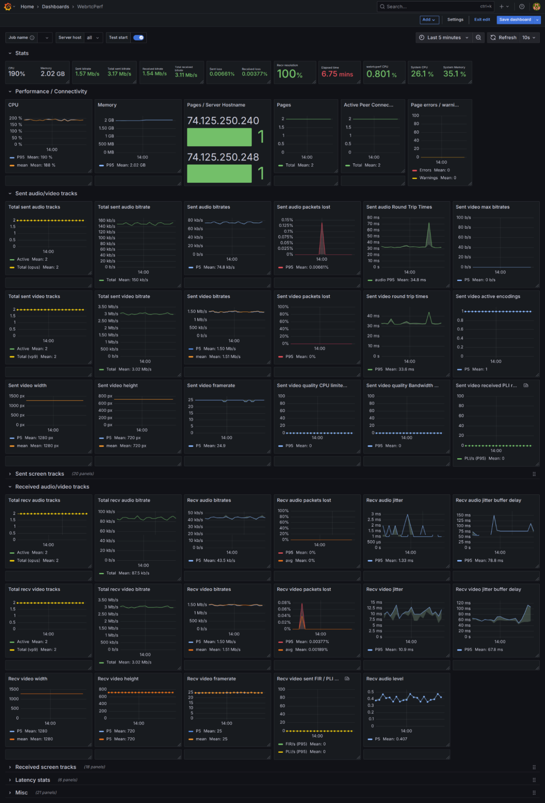

# Advanced usage

## URL options

In the previous examples we used the `--url` option to set a page target URL that is used by all the running sessions. The tool has other two options in order to customize the destination url:

- `--url-query`: It allows you to specify an additional URL query string that will be attached to the provided `--url`. The string can include some template variables that will be replaced at run time:  
  - `$p` the process pid  
  - `$s` the session index  
  - `$S` the total sessions  
  - `$t` the tab index  
  - `$T` the total tabs per session  
  - `$i` the tab absolute index

  Example: `--url-query=”participantName=Test-$i”` will attach `?participantName=Test-0`, `?participantName=Test-1` to the corresponding session url.

- `--custom-url-handler`: This option accepts a javascript module path containing a single exported function that will be invoked for each started session. Use this option without setting the `--url` option.  
  The function will be invoked with a single object with the following properties:  
  - sessions: the total number of sessions;  
  - tabsPerSession: the total number of tabs per session;  
  - id: the session global index (0-indexed);  
  - index: the tab global index (0-indexed);  
  - tabIndex: the tab index in the current session (0-indexed);  
  - pid: the process pid;  
  - env: the environment variables object;  
  - params: the script parameters object.

    Example script:
    ```js
    export default function ({ id, sessions, tabIndex, tabsPerSession, index, env, pid }) {
      return `https://example.com/${id}/${sessions}/${tabIndex}/${tabsPerSession}/${index}/${pid}`
    }
    ```

## The getUserMedia input options

The tool leverages several options offered by chromium to specify an audio/video input file that will be used as getUserMedia source. Using fake audio and video allows us to run consistent and repeatable tests, without introducing the implicit randomness that will be caused by running tests with a local webcam/microphone inputs.  
The tool allows to configure the following options:

- `--video-path`: A file path used as source for the audio and video streams. FFMpeg will be used to convert this file into a format that is accepted by the chromium options, thus any input format accepted by ffmpeg is a valid value (e.g. `https://…`). Additionally, using `generate:null` will generate a black video and silent audio track; with `generate:test` it will generate an ffmpeg `testsrc` video pattern and a single frequency audio with beep pattern. The option is set by default to this test video [https://github.com/vpalmisano/webrtcperf/releases/download/videos-1.0/kt.mp4](https://github.com/vpalmisano/webrtcperf/releases/download/videos-1.0/kt.mp4). More test videos are available under this release tag: [https://github.com/vpalmisano/webrtcperf/releases/tag/videos-1.0](https://github.com/vpalmisano/webrtcperf/releases/tag/videos-1.0).  
- `--video-width`, `--video-height`, `--video-framerate`: the resolution and the video frame rate that will be used to upscale or downscale the input video.  
- `--video-seek`: the seek time in seconds from the start in the provided video.  
- `--video-duration`: the total duration used to trim the input video.  
- `--video-cache-raw`: when true (default value) the generated files will be cached into the `~/.webrtcperf/cache` directory.  
- `--video-format`: the video format used for video track conversion; it could be “y4m” (raw yuv video, the default value) or “mjpeg”.  
- `--use-fake-media`:   
  - when true (default), the supplied file specified with videoPath will be converted into raw audio and video files that will be passed to the chromium executable using the `use-fake-ui-for-media-stream`, `use-file-for-fake-video-capture` and `use-file-for-fake-audio-capture` params. The getUserMedia calls will output tracks generated from the provided raw files.  
  - When false, the browser will run without any fake media option but the webrtcperf default page script will override the getUserMedia call loading an hidden video element inside the page and using it as source for the generated tracks. The advantage of using this approach is that the audio and video tracks will run in sync, so it can be used to detect audio/video desynchronization; the disadvantage is the higher page memory and CPU usage caused by decoding the fake media.

## The getDisplayMedia input options

The chromium default behaviour to fake the display media track allows to get a generated video animation that is usually very different from what we have in a regular video conference when users share a static presentation with slide transitions. In fact, the chromium generated animation produces a constant bitrate stream, while a real presentation generates a low bitrate at average with big spikes caused by the slide transitions. Emulating this behavior is essential to assess the video quality of the screen sharing in a video conference service.  
In webrtcperf, the getDisplayMedia calls will output a video track that is obtained from sharing the current browser window (when `--use-fake-media=true`) or a new browser tab  (`--use-fake-media=false`). In both cases, the tool will use a page script automation that generates a fake screenshare sequence that can be customized adding a `fakeScreenshare` option in the `--script-params` command line option. The `fakeScreenshare` option accepts the following params:

- `animationDuration`: the slide animation duration expressed in milliseconds (default: 1000).  
- `delay`: the slide change delay in milliseconds (default: 5000).  
- `embed`: an optional URL specifying a document or an external Google Drive presentation that will be loaded inside an iframe element.  
- `width`, `height`: the screen share resolution (default: 1920x1080)  
- `pointerAnimation`: if different from zero, it will draw a random animation emulating the mouse movement.  
- `slides`: the total slides to generate (default: 4).  
- `urls`: an optional array of strings that could include (even in mixed order):  
  - an image or video URL that will be used as slide content;  
  - a document that will be embedded into an iframe element and it will be used as slide content.

    When both slides and embed are not provided, the tool will load the images from [https://picsum.photos](https://picsum.photos).

## Network throttling

Internet available bandwidth, network latency and packet loss are factors that usually could impact the perceived quality of a video conference service. Replicating the network conditions that affect real users is usually a good way to assess if the WebRTC service is able to adapt to the available bandwidth (increasing or decreasing the video resolution and the framerate) and deal with the packet loss and delay.  
The webrtcperf tool includes a network throttling functionality offered by the [https://github.com/vpalmisano/throttler](https://github.com/vpalmisano/throttler) project, that is essentially a NodeJS wrapper of the Linux Traffic Controller framework ([https://tldp.org/HOWTO/Traffic-Control-HOWTO/intro.html](https://tldp.org/HOWTO/Traffic-Control-HOWTO/intro.html)) and NetEm. The `--throttle-config` param accepts a JSON/JSON5 encoded string containing an array of  throttler configuration; each configuration item is an object containing the following properties:

- **sessions** (string): The webrtcperf sessions IDs that will use this throttle configuration. It could be a single index ("0"), a range ("0-2") or a comma-separated list ("0,3,4").  
- **up**, **down** (string, JSON): A single or an array of throttle rules that will be applied to the uplink and to the downlink.  
- **protocol** ("udp" | "tcp"): If specified, only TCP or UDP packets will be throttled.  
- **device** (string): The network interface to throttle. If not specified, the default interface will be used.  
- **filter** (string): An additional IPTables packet filter rule.  
- **match** (string): An additional [TC match expression](https://man7.org/linux/man-pages/man8/tc-ematch.8.html) used to filter packets.
- **skipSourcePorts**, **skipDestinationPorts** (string): A comma-separated list of source and destination ports that will not be throttled. Example usage: in some cases it is better to avoid throttling the 80,443 ports, otherwise the web application will fail to load.  
- **capture** (string): If set, the packets matching the provided session and protocol will be captured at that file location in PCAP format.

Each throttle rule could include the following properties that controls the corresponding value in the [NetEm](https://man7.org/linux/man-pages/man8/tc-netem.8.html) tool:

-   **rate**: The available bandwidth (Kbps).  
-   **delay**: The one-way delay (ms).   
-   **delayJitter**: The one-way delay jitter (ms).   
-   **delayJitterCorrelation**: The one-way delay jitter correlation.  
-   **delayDistribution**: The delay distribution ('uniform' | 'normal' | 'pareto' | 'paretonormal').  
-   **reorder**: The packet reordering percentage.  
-   **reorderCorrelation**: The packet reordering correlation.  
-   **reorderGap**: The packet reordering gap.  
-   **loss**: The packet loss percentage.  
-   **lossBurst**: The packet loss burst.  
-   **queue**: The packet queue size.  
-   **at**: If set, the rule will be applied after the specified number of seconds.

**Examples**  
Run a two participants video conference on Google Meet, throttling the the first participant uplink at 500Kbps, 100ms delay and 2% packet loss:

```bash
webrtcperf \
  --sessions=2 \
  --run-duration=300 \
  --url=https://meet.google.com/<ID> \
  --debugging-port=9000 \
  --script-path=https://raw.githubusercontent.com/vpalmisano/webrtcperf/refs/heads/devel/examples/google-meet.js \
  --prometheus-pushgateway=http://localhost:9091 \
  --throttle-config='[{sessions:"0",protocol:"udp",up:[{rate:500,delay:100,loss:2,queue:50}]}]'
```

The “Participant-000000” video stream has a visible lower quality compared with “Participant-000001”:  
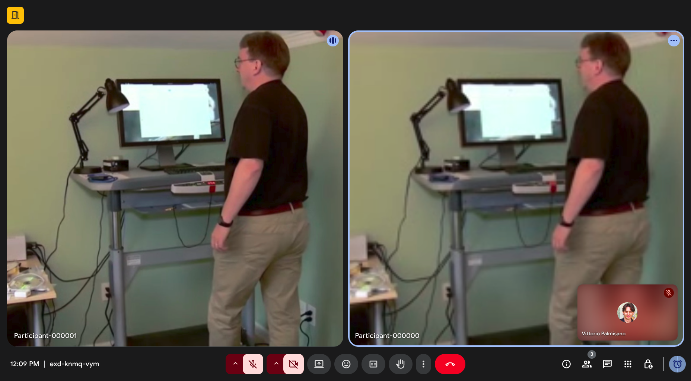

Comparing the same test run without and with network throttler option, we can see how the sent bitrate decreased from an average of ~600Kbps down to ~300Kbps; packet loss increased up to 1-2% and the round trip time increase from ~40ms up to ~150ms:  
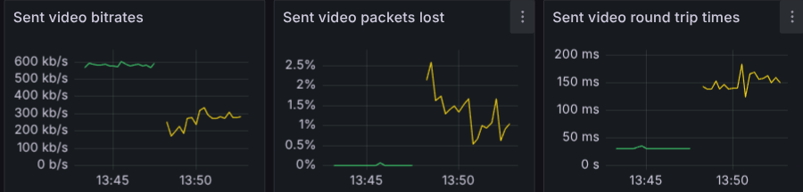

Let’s run another test with a different throttle configuration. In this case we specify multiple rules for the upstream limitation, using a different `at` value for each one, in particular what we want to test is:

- start applying a bitrate limitation of 1Mbps;  
- after 60 seconds, change the bitrate limitation to 500Kbps;  
- after 60 seconds, set the bitrate again to 1Mbps.

```bash
webrtcperf \
  --sessions=2 \
  --run-duration=300 \
  --url=https://meet.google.com/<ID> \
  --debugging-port=9000 \
  --script-path=https://raw.githubusercontent.com/vpalmisano/webrtcperf/refs/heads/devel/examples/google-meet.js \
  --prometheus-pushgateway=http://localhost:9091 \
  --throttle-config='[{   
      sessions:"0",   
      protocol:"udp",   
      up: [     
        { rate:1000, delay:100, queue:50 },
        { rate:500, delay:100, queue:50, at:60 },     
        { rate:1000, delay:100, queue:50, at:120 },
      ] 
    }]'
```

Looking at the measured metrics, we see the effect of the bandwidth limitation change:

- the video bitrate decreased from 600Kbps to 300Kbps from t=60 to t=120;  
- we got some packet loss after the bandwidth decrease;  
- the bandwidth quality limitation indicator increased to ~80% in the same time interval.

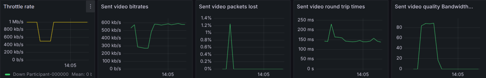

## Random speaker emulation

Using a fake media file with continuous speech when we run tests with multiple participants is not close to what happens in a real video conference room, when participants usually talk at turn without overlapping. The webrtcperf page automation permits to automatically  activate/deactivate the audio tracks captured with getUserMedia changing the `track.enabled` property; the mechanism can be controlled with the following command line options:

- `--random-audio-period`: It specifies the maximum period in seconds after which a new random active session is selected, enabling the getUserMedia audio tracks in that session and disabling all of the others.  
- `--random-audio-probability`: it defines the probability % that the selected audio will be activated (default: 100%). Setting this value to value lower than 100, will have the effect of deactivating the audio for all the sessions.  
- `--random-audio-range`: It defines the session indexes that should be included into the random selection mechanism (default: include all the sessions).

Additionally to the `track.enabled` property, the tool will invoke the `publisherSetMuted(true | false)` function, if that function has been implemented in a custom page script (loaded with `--script-path`); this way it is possible to trigger the muted state clicking on the corresponding mute/unmute button inside the page, depending on the particular service we are testing.

## Using the custom Chromium build to save CPU

Running tests with many participants increases the amount of CPU required to render the page, encode the audio/video streams and decode them at the receiver side. The webrtcperf docker image includes a [modified Chromium version](https://github.com/vpalmisano/webrtcperf/blob/devel/chromium/max-video-decoders_main.patch) that allows the tool to specify a maximum number of RTC video streams to decode in parallel for each browser session. The value can be controlled using the following command line options:

- `--max-video-decoders`: The maximum number of RTC video streams that will be decoded by each browser session (default: 0, decode all the videos).  
- `--max-video-decoders-range`: It applies the max video decoders option to the sessions included into this list (default: “true” that will include all the sessions).

It is worth noticing that disabling the video stream decoding would cause some RTC metrics (e.g. the received width, height, framerate) to always report a zero value. The suggested way to use this feature is keeping the video decoder enabled for a percentage of sessions, depending on the amount of cpu that we want to save.  
The modified Chromium version can be build from sources using the following commands:

```bash
git clone https://github.com/vpalmisano/webrtcperf.git
cd webrtcperf/chromium
./build.sh setup
 # Use a valid tag version
./build.sh update "tags/139.0.7230.1"
./build.sh build 
# install the package (on Ubuntu/Debian)
sudo dpkg -i ./chromium-browser-unstable_139.0.7230.1-1_amd64.deb
```

Once that the custom Chromium package has been installed, specify the executable path with the `--chromium-path` option (or setting the `CHROMIUM_PATH` env variable):

```bash
export CHROMIUM_PATH=/usr/bin/chromium-browser-unstable
webrtcperf https://raw.githubusercontent.com/vpalmisano/webrtcperf/refs/heads/devel/examples/scenarios/mediasoup.json
```

## Additional logging options

The tool offers several logging options to save the opened pages logs and, optionally, the full chromium process output.

- `--show-page-log`: If true (default) the pages console logs will be shown on console.  
- `--page-log-filter`: If set, only the logs with the matching text or regular expression will be printed on the console.  
- `--page-log-path`: If set, the page console logs will be saved on the selected file path.  
- `--enable-browser-logging`: It enables the Chromium browser logging for the specified session indexes. It requires the `--page-log-path` option to be set.  When enabled, the tool will enable the chromium verbose logging (with `--vmodule=*/webrtc/*=5`) that will be written into the page log path directory. It also activates the Chromium `--webrtc-event-logging` option, that will save the event logging file in the same directory (you can use [https://github.com/fippo/dump-webrtc-event-log](https://github.com/fippo/dump-webrtc-event-log) to parse this file).

## The script automation

In the previous examples we used the `--script-path` option providing a javascript page that runs some page automation (like automatically filling in the participant name and clicking on the join button). By default, the webrtcperf tool will load the [webrtcperf-js](https://github.com/vpalmisano/webrtcperf-js) script bundle, that provides a number of utilities to automate the testing tasks and run advanced measurements into the page context. The custom script provided with `--script-path` option can access the webrtcperf-js utilities under the `webrtcperf` global object. Some of the features offered by webrtcperf-js needs to be configured at the page load time; at this purpose, webrtcperf offers the `--script-params` option that can be used to provide a JSON/JSON5 object with the values that will be set into the `webrtcperf.params` object.

### Measuring the end-to-end (mouth-to-ear) delay

Setting the `timestampWatermarkAudio` and `timestampWatermarkVideo` script params will enable a webrtcperf-js feature that automatically applies a video watermark overlay and an audio modulated signal containing the sender UNIX timestamp. At the receiver side, the video overlay will be recognized using the [Tesseract.js library](https://tesseract.projectnaptha.com/), while the audio signal will be decoded with the [ggwave library](https://github.com/ggerganov/ggwave). Subtracting the decoded value from the UNIX timestamp at receiver side we will obtain the total end to end delay that occurs from the audio/video frame capture time to the display time (please note that the sender and receiver machine clocks need to be synchronized, otherwise we will introduce an error in the delay estimation).  
Example usage:

```bash
webrtcperf \
  --sessions=2 \
  --run-duration=300 \
  --url=https://meet.google.com/<ID> \
  --debugging-port=9000 \
  --prometheus-pushgateway=http://localhost:9091 \
  --script-path=https://raw.githubusercontent.com/vpalmisano/webrtcperf/refs/heads/devel/examples/google-meet.js \
  --script-params='{timestampWatermarkAudio:true,timestampWatermarkVideo:true}'
```

### Measuring the network end-to-end delay using the abs-capture-time extension

The webrtcperf-js library comes with another mechanism that can be used to estimate the network end-to-end delay. Setting the `absCaptureTime` script param, the library will modify the SDP offer inserting the the `abs-capture-time` header extension (https://datatracker.ietf.org/doc/draft-ietf-avtcore-abs-capture-time/) for audio and video media sections. If the SFU supports this extension header, the receiver side will receive the `captureTimestamp` value into the corresponding contributing source. Consider also that some video conferencing applications (e.g. Google Meet) already uses this header, so you don’t need to add any script param to get the measurement.  
The code used to calculate the delay is the following:

```js
const contributingSource = receiver.getSynchronizationSources()[0]
const captureTimestamp = contributingSource?.captureTimestamp
const senderCaptureTimeOffset = contributingSource?.senderCaptureTimeOffset

if (contributingSource && captureTimestamp && senderCaptureTimeOffset !== undefined) {
  endToEndDelay = (contributingSource.timestamp - (captureTimestamp + senderCaptureTimeOffset - 2208988800000)) / 1000
}
```

As we can see, the delay is calculated as the time difference from the current timestamp and the capture timestamp, using the time offset to compensate the clock difference between the sender and the receiver machines; both the capture and the offset are NTP time based (midnight UTC on January 1, 1900), so we need to rebase them to the UNIX start time (midnight UTC on January 1, 1970).  
The End-to-End delay calculated with the abs-capture-time extension in a Google Meet test (`audioEndToEndDelay` and `videoEndToEndDelay` metrics):  
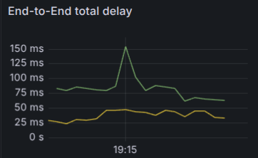

The advantage of using this option is that it does not require any audio or video watermarking, and it will save some CPU at the receiver side required to run the image recognition. Anyway, this method takes into account only the RTP one-way delay on the network path; if you want to get a more accurate delay you should add the encoding (`videoEncodeLatency`) and the decoding (`videoDecodeLatency`) metrics values to the `videoEndToEndDelay` value.

### Run page automations

Setting the `actions` script params value allows us to run several page tasks at different times, starting from the webrtcperf launch time. Each action object could include the following properties:

- **name** (string): the javascript method to call (it must be a globally exported method).  
- **params** (array): the method arguments.  
- **index** (string): the webrtcperf session indexes where the action must run.   
- **at** (number): the number of seconds from the test start when the action should run. If the page load took more time than “at” seconds, the action run is skipped.  
- **relaxedAt** (number): use this in place of the “at” property if you want to run the action even if the scheduled time is greater than the elapsed time.  
- **every** (number): if set, the action will run at regular intervals.  
- **times** (number): the number of times the action should run.

Example: assuming you have defined a `muteParticipant` custom function to mute/unmute the microphone, use this script actions to mute “Participant-000000” after 60 seconds and unmute it after 180 seconds form the test launch time:

```bash
webrtcperf \
  --sessions=2 \
  --run-duration=300 \
  --url=https://meet.google.com/<ID> \
  --debugging-port=9000 \
  --prometheus-pushgateway=http://localhost:9091 \
  --script-path=https://raw.githubusercontent.com/vpalmisano/webrtcperf/refs/heads/devel/examples/google-meet.js \
  --script-params='{
      actions: [
        { name: "muteParticipant", params: [true], index: "0", at: 60 },
        { name: "muteParticipant", params: [false], index: "0", at: 180 },
      ]
    }'
```

The audio bitrate sent by Participant-000000 reports an empty period in the muted period:  
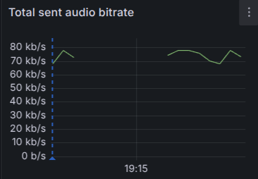

The audio bitrates received by Participant-000001 reflect the audio paused period:  
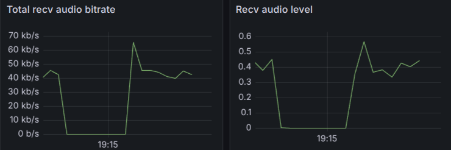

## Page response modifiers

Using the `--response-modifiers` option it is possible to run a string replacement of one or more HTTP requests made by the page (including XHR, assets, etc.). It accepts a JSON object with the URL request pattern and a list of one of more desired replacements.   
Examples:

- Perform a string replacement into each *.js request made to the selected URL:    
  `{ "https://url.com/*.js": [{ search: "searchString": replace: "anotherString" }] }`  
- Completely replace the request output with a local file:  
  `{ "https://url.com/file.js": [{ file: "path/to/newFile.js" }] }` 

Another useful option to debug the page requests is `--download-reponses`. It accepts an array of URL patterns that we want to save as local files. Example, saving the HLS mpegts fragments download while watching a live stream will require something like this:  
`[{ urlPattern: "https://url.com/*.ts", output: "save/directory" }]`

## Custom headers, CSS, cookies

- `--extra-headers`: Specify this option to add custom HTTP headers to each request. Example:   
  `{ "https://url.com/*": { "Authorization": "Bearer secret" } }`   
  It will attach an “Authorization” header for each request made to the specified URL pattern.  
- `--extra-css`: A string containing the CSS rules that will be injected inside the page content.  
- `--cookies`: An array of CookieParam JSON objects ( [https://pptr.dev/api/puppeteer.cookieparam](https://pptr.dev/api/puppeteer.cookieparam)) that will be set into the running web page.

## Debugging options

The tool accepts the following options that allow us to access the Chromium opened pages with the devtools inspector (chrome://inspect/#devices). This way we can access the page context while running the test to debug the web application.  
The options that allow to configure the debugger are:

- `--debugging-port`: If not zero, it will enable the Chromium debugger listening on the selected port.  
- `--debugging-address`: The Chromium browser allows listening only on `127.0.0.1` address, so it is not possible to reach a session running inside a docker container or on a remote machine. When this option is set, webrtcperf will start a port forwarder allowing you to connect to the devtool protocol even if the page is running remotely.

Other misc options that simplify the page debugging are:

- `--emulate-cpu-throttling`: When different from zero, it will use the devtools CPU throttling feature in order to throttle the page javascript execution, emulating a slow device.  
- `--hardware-concurrency`: It overrides the `navigator.hardwareConcurrency` property. Some web conference providers use this option to infer the machine capabilities and reduce the video resolution and framerate accordingly with the detected number of CPU cores.  
- `--device-scale-factor`: The browser device scale factor to use (default: 1).  
- `--user-agent`: A custom user agent string to use.  
- `--chromium-field-trials`: A valid Chromium field trials override string.   
- `--local-storage` and `--session-storage`: A JSON object that will be set in the page `localStorage` and `sessionStorage` at the page load.  
- `--override-permissions`: A comma separated list of permissions to grant to the page. The possible values are listed here: [https://developer.mozilla.org/en-US/docs/Web/HTTP/Reference/Headers/Permissions-Policy#directives](https://developer.mozilla.org/en-US/docs/Web/HTTP/Reference/Headers/Permissions-Policy#directives).  
- `--debug`: It allows to increase the tool logging messages verbosity. See [https://github.com/commenthol/debug-level#readme](https://github.com/commenthol/debug-level#readme) for the syntax.

## Alert rules

After running tests we need to usually look at the collected metrics in the Grafana interface or directly from the output logs and inspect them looking at packet loss values, low bandwidth or resolutions, etc.  
Webrtcperf comes with a functionality that tries to automate the metrics inspection and the failure detection by running a value checking step every time the metrics are collected. The value checks can be specified providing a valid JSON string to the `--alert-rules` option containing a single object with the metrics that we want to check with the corresponding alert rule definition.

**Example 1**: we want to check if the sum of the active peer connections is equal to 100 after 1 minute from the test start.

```bash
--alert-rules='{
  pages: {
    tags: ["connectivity"],
    sum: { "$eq": 100, "$after": 60 },
  },
}'
```

**Example 2**: we want to check if, after 2 minutes, the number of received videos is equal to 25 and if the 5th percentile of the received bitrates is included into the 2-3 Mbps range.

```bash
--alert-rules='{
  videoRecvBitrates: {
    tags: ["quality"],
    length: { "$eq": 25, "$after": 120 },
    p5: { "$gt": 2000000, "$lt": 3000000, "$after": 120 },
  },
}'
```

The full list of the metrics collected by webrtcperf is available [here](https://vpalmisano.github.io/webrtcperf/enums/rtcstats.RtcStatsMetricNames.html). The metric rules could include these specifiers:

- length: the number of metrics actually collected (e.g. the number of video streams);  
- sum: the sum of the metric values;  
- min, max, mean, p5, p95: minimum, maximum, 5th and 95th percentile values.

The value checks could include:

- $eq: metric value must be equal to the specified value;  
- $gt, $gte: metric value must be greater / greater or equal to the value;    
- $lt, $lte: less / less or equal;  
- $after: the tool will start evaluating the rule after the provided value in seconds;  
- $before: the tool will stop evaluating the rule after the provided value in seconds.

The optional “tag” rule can be used to group the test rule into a custom category. If the `--alert-rules-output` is specified, at the end of the test the tool will write a JSON file with the test results grouped by category tag, reporting the percentage of time the metrics checked in each category failed to match the corresponding rules. You can use this output to trigger an automated alert in a monitoring system every time the test results are different from the expected values. Additionally, for each alert rule check, the tool will add a Prometheus `_alert` metric that can be used to visualize the alert threshold in Grafana and report if the metric check is failing or not.

**Example 3**: running a test with 2 participants visiting a Mediasoup demo page; the first participant will run with limited downlink network (1Mbps, 100ms delay) and we want to check if the video received bitrate falls into the interval 400Kbps - 1Mbps:

**mediasoup_r1000-d100.yaml** scenario configuration:

```yaml
sessions: 2
runDuration: 300
url: 'https://v3demo.mediasoup.org/?roomId=webrtcperf-test-12345&displayName=Participant-$i'
debuggingPort: 9000
prometheusPushgateway: 'http://localhost:9091'
showPageLog: false
showStats: false
statsInterval: 5
throttleConfig: |
    [{
        sessions: "0",
        protocol: "udp",
        down: [
            { rate: 1000, delay: 100, queue: 50 },
        ]
    }]
alertRules: |
    {
        peerConnections: {
            tags: ["connectivity"],
            sum: { "$eq": 4, "$after": 30 },
        },
        videoRecvBitrates: {
            tags: ["quality"],
            length: { "$eq": 2, "$after": 30 },
            p5: { "$gt": 400000, "$lt": 1000000, "$after": 30 },
        },
    }
alertRulesOutput: 'results.json'
```

Test command:

```bash
webrtcperf mediasoup_r1000-d100.yaml
```

We can see the Grafana metric and the corresponding alert rule state; in this case the 5th percentile doesn't match the expected values, so we have some alert check failures.  
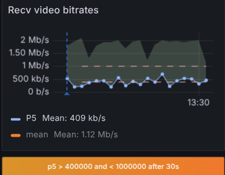

The **results.json** content and the end of the test reports a test failure percentage of 48%, with the details about how many times and the total duration the check failed:

```json
{
  "tags": {
    "connectivity": 0,
    "quality": 48
  },
  "reports": {
    "videoRecvBitrates p5 > 400000 and < 1000000 after 30s": {
      "totalFails": 18,
      "totalFailsTime": 50,
      "valueAverage": 419731.18521030556,
      "totalFailsTimePerc": 19,
      "failAmount": 48,
      "count": 54
    }
  }
}
```

If we change the `videoRecvBitrates` alert rule using `"$gt": 100000` the test checks are successful instead:  
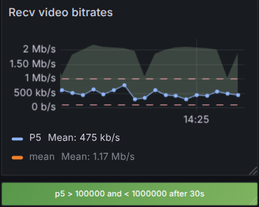

# VMAF quality evaluation

Evaluating the video quality in most cases requires a visual inspection of the output streams searching for artifacts, deblocking effects, etc. Running this comparison in an automated way is preferable and it allows the test infrastructure to immediately report an alert when the detected quality doesn’t match the expected value while running the same test scenario in the same conditions.  
VMAF (Video Multimethod Assessment Fusion) is a perceptual video quality assessment algorithm developed by Netflix (https://github.com/Netflix/vmaf). It's a full-reference metric, meaning it requires both a reference (original) and a distorted (encoded) video for evaluation. VMAF aims to predict video quality by combining several metrics into a single score value (ranging from 0 to 100). VMAF has been designed to assess the video encoding quality assuming that the distorted version of the video contains exactly the same video frames of the input video. This is not true in the WebRTC context, where the received video could be affected by delay (implicit network delay, jitter buffer, encode/decode operations) and packet loss. The missing perfect relationship between the sent and the received video frames makes it impossible to use the VMAF tool as it is, after simply recording the video streams at sender (reference) and at the receiver side (distorted). The webrtcperf tool integrates a video watermarking mechanism that we previously used to measure the end-to-end video delay (`timestampWatermarkVideo`). Having both the reference and the distorted video files with an overlay timestamp on each frame, the tool is able to process the video files, align them and filter the frames that have the same timestamp overlay. After the alignment step, the tool evaluates the video score using the libvmaf ffmpeg filter. What we get here is a perceptual indication of the video degradation caused by the encoder that could reduce the bitrate to match the available bandwidth. It is worth noticing that the tool will not evaluate the video quality for dropped (lost) frames, so the obtained VMAF score must be combined with the other WebRTC metrics (like the packet loss and the received video frame rate) to have a complete quality evaluation.  
The suggested way to use this feature is running the webrtcperf docker image that already includes a patched ffmpeg version with the libvmaf filter.

Example test running the VMAF quality evaluation (start the prometheus stack before running the test):

```bash
docker run -it --rm \
  -v /dev/shm:/dev/shm \
  -v $PWD/data:/data \
  -p 9000 \
  --net=prometheus-stack_default \
  ghcr.io/vpalmisano/webrtcperf:devel \
  --sessions=2 \
  --run-duration=180 \
  --url=https://meet.google.com/<ID> \
  --debugging-port=9000 \
  --script-path=https://raw.githubusercontent.com/vpalmisano/webrtcperf/refs/heads/devel/examples/google-meet.js \
  --prometheus-pushgateway=http://pushgateway:9091 \
  --script-params="{timestampWatermarkVideo:true,saveSendVideoTrack:'0',saveRecvVideoTrack:'1'}" \
  --server-port=5000 \
  --server-use-https \
  --server-data=/data \
  --vmaf-path=/data \
  --vmaf-preview
```

The tool will run a Google Meet conference with 2 participants, saving the “Participant-000000” sent video (`saveSendVideoTrack:’0’`) and the “Participant-000001” received video (`saveRecvVideoTrack:'1'`). We need to activate the tool in server mode (`--server-port`) in order to save the video frames captured inside the web page automation. Adding the `--vmaf-path` option will make the tool running the VMAF evaluation at the end of the test and `--vmaf-preview` will generate a side-by-side comparison between the reference and the degraded video.  
The VMAF outputs are:

- A folder name for each comparison made by the tool for the current test in the format `<Sender Participant>_recv-by_<Receiver Participant>`; for this simple test it will be `Participant-000000_recv-by_Participant-000001`. In each folder we will find the following files:  
  - `psnr.log` (the PSNR log);  
  - `vmaf-log.json` (the full VMAF output);  
  - `vmaf-log.png` (a graph made with the frame-by-frame scores);  
  - `comparison.mp4` with the side-by-side comparison.  
- A vmaf.json file containing some aggregate VMAF scores for each comparison.

**vmaf-log.png**:  
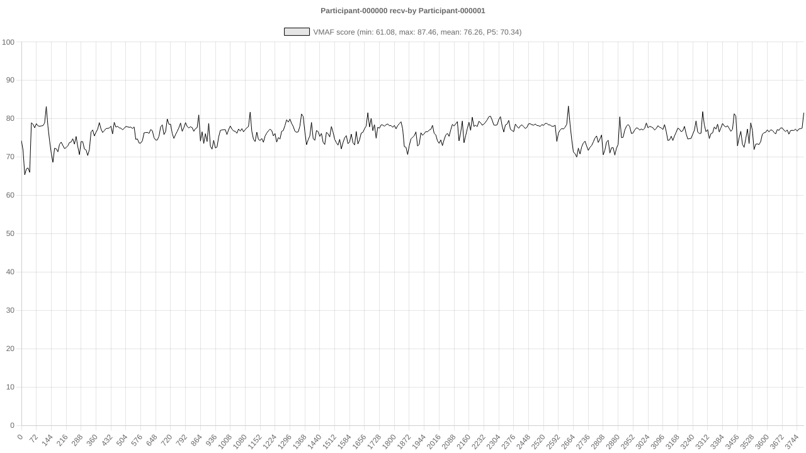

**vmaf.json:**
```json
[
  {
    "sender": "Participant-000000",
    "receiver": "Participant-000001",
    "min": 61.083063,
    "max": 87.46276,
    "mean": 76.260023,
    "harmonic_mean": 76.118533
  }
]
```

Other options for controlling the VMAF evaluation are:

- `--vmaf-keep-source-files`: True by default, it keeps the recorded raw video files in the destination folder after the evaluation.  
- `--vmaf-keep-intermediate-files`: False by default, when true all the intermediate video files used by the VMAF tool will be kept on the destination folder, allowing to debug them.  
- `--vmaf-skip-duplicated`: False by default, when true the tool will skip the frames with the same recognized timestamp. Use this option if the encoder used by the service you are testing applies a frame duplication to match the configured framerate (e.g. this could happen when testing HLS videos).  
- `--vmaf-crop`: a JSON string with a crop configuration to be applied to reference and/or degraded videos. The crop configuration should be expressed using the ffmpeg crop filter syntax ([https://ffmpeg.org/ffmpeg-filters.html#crop](https://ffmpeg.org/ffmpeg-filters.html#crop)).  
  Example:
    ```js
    {
      "Participant-000001_recv-by_Participant-000000": {
        ref: { w: "iw-10", h: "ih-5" },
        deg: { w: "200", h: "200" }
      }
    }
    ```

# Run distributed tests

Running tests with multiple participants usually requires an amount of CPU and memory that could not match the host machine capabilities. Additionally, running tests with high resolution video and/or receiving streams from many remote participants in the same conference room will require an amount of bandwidth that could not be available on a single host. For these reason, when running tests with many concurrent participants, the preferred way to use webrtcperf is activating the server mode option in one instance (we will call it “collector’) and run all the other required webrtcperf test instances in different hosts (“worker’); the worker instances will collect the metrics scraped from the local running sessions and will send them to the collector, that will aggregate and send them to the Prometheus Pushgateway service.

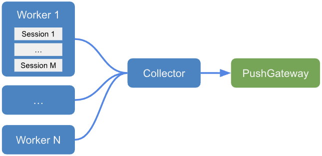

Example command to start webrtcperf in “collector” mode on host 192.168.0.1:

```bash
webrtcperf \
  --run-duration=200 \
  --prometheus-pushgateway=http://127.0.0.1:9091 \
  --server-port=5000 \
  --server-use-https \
  --server-secret=<SECRET>
```

Example command to start two “worker” instances on different hosts, running 50 participants each one:

```bash
# Worker 1 
webrtcperf \
  --sessions=50 \
  --run-duration=180 \
  --url=<URL> \
  --push-stats-url=https://192.168.0.1:5000 \
  --server-secret=<SECRET> \
  --push-stats-id=1 \
  --start-session-id=0 \
  --start-timestamp=1749212181000

# Worker 2
webrtcperf \
  --sessions=50 \
  --run-duration=180 \
  --url=<URL> \
  --push-stats-url=https://192.168.0.1:5000 \
  --server-secret=<SECRET> \
  --push-stats-id=2 \
  --start-session-id=50 \
  --start-timestamp=1749212181000
```

Please note that you need to add the following options for each worker:

* The collector address/port with `--push-stats-url`.  
* A unique identifier with `--push-stats-id` that will be used by the collector to aggregate the metrics coming from that worker.  
* You need to set `--start-session-id` to 50 in the second host, so the participants will be indexed starting from Participant-000050 to Participant-000099.  
* Use the same `--start-timestamp` for both hosts and set it to the same UNIX timestamp expressed in milliseconds. This way all the action automation running on each host will be time synchronized (example: unmuting Participant-000001 and Participant-000051 at time 60 will be executed at the same clock time on both instances). Worker machines' clocks must be synchronized.  
* Use the same `--server-secret` value for both collector and workers.

For the collector configuration, use a longer `--run-duration` option just to avoid missing the last metric updates from the worker hosts.

# Experimental features

## Run tests with the AI prompt
The `--prompt` option allows you to run a test with an AI prompt that will be used to generate the test scenario configuration. 
The prompt should be an accurate description of the test scenario that we want to run, including the number of participants, the service URL, the network throttling configuration, etc. The prompt will be sent to the [Google Gemini AI](https://ai.google.dev/) service and the response will be parsed to generate a valid test configuration.

Example usage:

```bash
export GEMINI_API_KEY=<key>
webrtcperf --prompt "run a 2min test with 2 sessions on 'https://v3demo.mediasoup.org/?roomId=webrtcperf-test-12345' limiting the 2nd session upstream at 1Mbps with 1% packet loss for 30s, 2Mbps for 30s and 1Mbps for all the remaining time"
```

Add the `--dry-run` option to print the generated test configuration without running it:

```bash
webrtcperf --prompt --dry-run "run a 2min test with 2 sessions on 'https://v3demo.mediasoup.org/?roomId=webrtcperf-test-12345' limiting the 2nd session upstream at 1Mbps with 1% packet loss for 30s, 2Mbps for 30s and 1Mbps for all the remaining time"
```

```
{
  throttleConfig: '[{ sessions: "1", up: [{ rate: 1000, loss: 1, at: 0 }, { rate: 2000, at: 30 }, { rate: 1000, at: 60 }] }]',
  runDuration: 120,
  sessions: 2,
  url: 'https://v3demo.mediasoup.org/?roomId=webrtcperf-test-12345',
}
```

# Authors
- Vittorio Palmisano [[github](https://github.com/vpalmisano)]

# License
[AGPL](./LICENSE)
