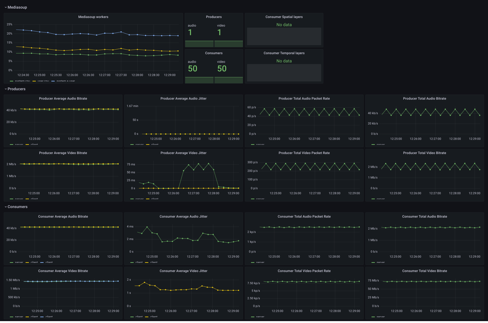

# Prometheus stack

Start the Prometheus / Grafana docker stack with:
```sh
docker-compose up
```

The docker-compose services are started inside the local docker network `192.168.1.0/24`. The host services can be accessed at `192.168.1.1`.

Docker services:
- Prometheus web interface: http://localhost:9090
- Pushgateway: `localhost:9091`
- Grafana web interface: http://localhost:3000 (user:pass `admin`:`admin`)

Scrape configuration:
- prometheus (`localhost:9090`) and node-exporter (`192.168.1.1:9100`) metrics
- process-exporter metrics (`process-exporter:9256`) used for collecting mediasoup-worker processes stats
- pushgateway metrics
- medianode metrics (`192.168.1.1:3000`)

To collect statistics from webrtc-stress-test, start the tool with the 
option: `--prometheus-pushgateway=http://localhost:9091` 
and (optionally): `--prometheus-pushgateway-job-name=<JOB_NAME>`. 

WebRTC stress test dashboard (http://127.0.0.1:3001/d/default/webrtc-stress-test):


Medianode statistics are collected from a medianode server running in localhost.

Medianode default dashboard (http://127.0.0.1:3001/d/medianode/medianode):

