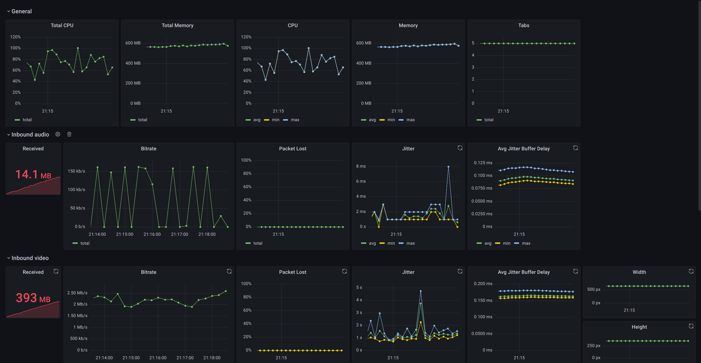

# Prometheus stack

Start the Prometheus / Grafana docker stack with:
```sh
docker-compose up
```

Services:
- Prometheus web interface: http://localhost:9090
- Pushgateway: `localhost:9091`
- Grafana web interface: http://localhost:3000 (user:pass `admin`:`admin`)
  Default dashboard: http://localhost:3000/d/default/webrtc-stress-test?orgId=1&refresh=10s

To collect statistics from webrtc-stress-test, start the tool with the 
option: `--prometheus-pushgateway=http://localhost:9091` 
and (optionally): `--prometheus-pushgateway-job-name=<JOB_NAME>`.

Default dashboard:

